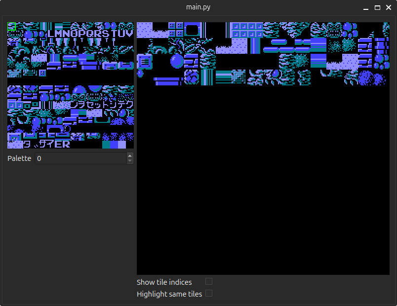
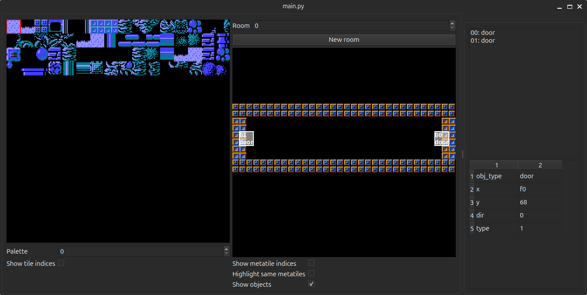
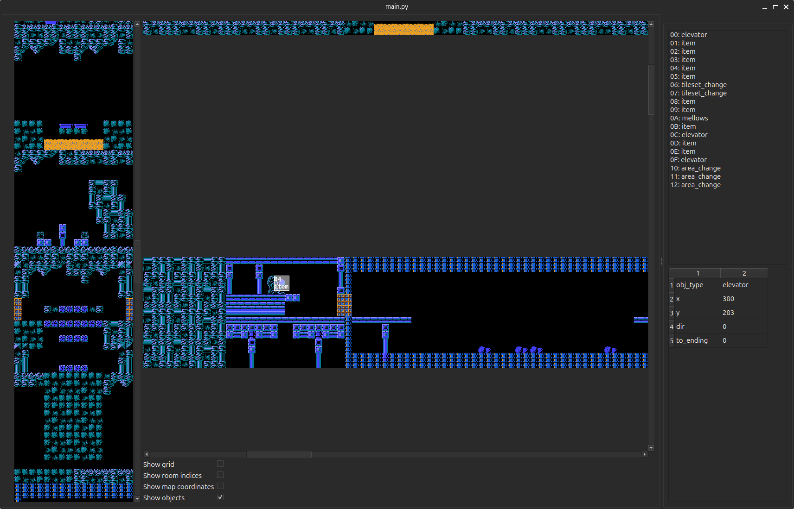

# m1disasm-editor

Editor for M1 disassembly (more specifically, this: https://github.com/H-A-M-G-E-R/m1disasm/tree/editor-ready).

## How to use

Run `pip install -r requirements.txt`

Download or build lzsa (linked below) and place the executable beside the README

Run `python3 main.py`

Open the data folder of an editor-ready M1 disassembly (template is in link above)

### Python requirements:

pyside6, numpy

### Other requirements:

lzsa: https://github.com/emmanuel-marty/lzsa

## Other tools you may also want to try:

NEXXT (gfx and metasprite editor): https://frankengraphics.itch.io/nexxt

# Screenshots

